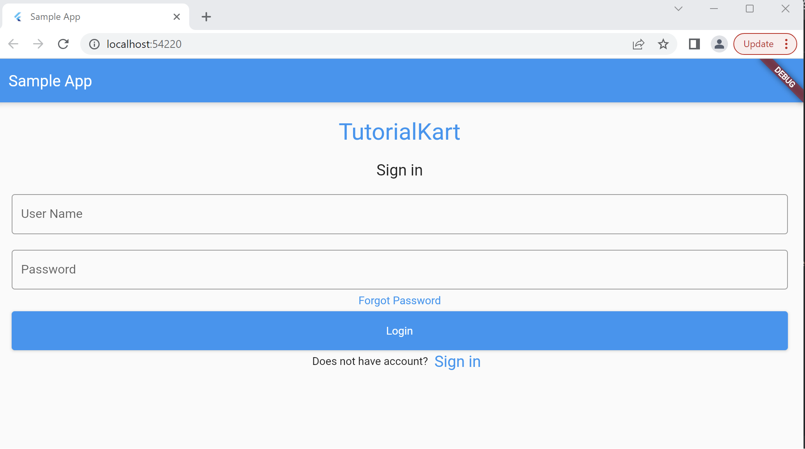

# binaries -
Flutter 3.13.6 • channel stable • https://github.com/flutter/flutter.git
Framework • revision ead455963c (6 days ago) • 2023-09-26 18:28:17 -0700
Engine • revision a794cf2681
Tools • Dart 3.1.3 • DevTools 2.25.0

# flut_autumn_demo_v3

A demo Flutter project to showcase the automation of a Login of a demo app :-

demo app: https://www.tutorialkart.com/flutter/flutter-login-screen/#gsc.tab=0

## Default Getting Started

This project is a starting point for a Flutter application.

A few resources to get you started if this is your first Flutter project:

- [Lab: Write your first Flutter app](https://docs.flutter.dev/get-started/codelab)
- [Cookbook: Useful Flutter samples](https://docs.flutter.dev/cookbook)

For help getting started with Flutter development, view the
[online documentation](https://docs.flutter.dev/), which offers tutorials,
samples, guidance on mobile development, and a full API reference.

## Pre-Requisites :)
Pre-Requisites
The pre-requisites that are common for flutter test automation
Android: Android Studio, Android Emulator Setup
IOS: Xcode, Simulator Setup
IDE — VS code/ Intellij/ Android Studio
Setup needed specific for Flutter
All that we need is Flutter SDK and a couple of IDE plugins. Please find below the links for the same and install them.
Flutter SDK
Install Flutter Plugin
Install Dart Plugin
Let's Begin
Step 1: Validate your flutter setup
Execute the command — “flutter doctor” If everything appears to be okay, you may continue; if not, follow the flutter doctor’s instructions to fix the problems.
Step 2: Sample application to automate — link shared above
Step 3: Install the dependencies
From the root folder of the project, execute the command — “flutter pub get” to install all the dependencies. This may take some time as it would download all the dependencies for the first time
Step 4: Launch the application
Let’s launch our application and understand the application’s screens and functions. Make sure your emulator or simulator is running
Right-click on lib/main.dart file and select Run without debugging.
Step 5: Inspect the widgets and add your unique ValueKeys (locators) -- already done & ready to use!

## test run commands
## (chrome)
flutter drive --driver=test_driver/integration_test.dart --target=integration_test/app_test.dart -d chrome
## (headless)
flutter drive --driver=test_driver/integration_test.dart --target=integration_test/app_test.dart -d web-server

or just add
--no-headless
to first command

## (mobile)
flutter test integration_test/app_test.dart
## or run all
    flutter test integration_test

## chrome driver
chromedriver --port=4444

flutter drive \
  --driver=test_driver/integration_test.dart \
  --target=integration_test/app_test.dart \
  -d chrome

  flutter drive \
  --driver=test_driver/integration_test.dart \
  --target=integration_test/app_test.dart \
  -d web-server